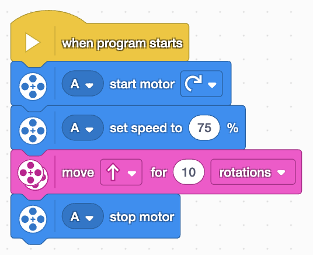

This year my daughter decided she wanted to her feet wet with robotics. We had tried [micro:bit](https://microbit.org/) in the past for basic hardware interaction and programming, and also picked up some [kits](https://learn.sparkfun.com/tutorials/microbot-kit-experiment-guide/all) from Sparkfun electronics, but she wanted more. 

# First Lego League
[**First Lego League**](https://www.firstlegoleague.org/season) is a good starting program for kids to get introduced to robotics. [**FIRST**](https://www.firstinspires.org/) has 3 levels of robotics competition, where FLL is the gateway to robotics for elementary and middle schoolers. The idea around FLL is for teams to build bots using lego, and not have to worry about CAD designing and constructing the bot, or its attachments from scratch. The coding of the bot on the other hand, is done via block programming tools similar to [Scratch](https://scratch.mit.edu/)!

The robotics team at middle school starts at 7th grade, so this season we are a community run group. Being robotics, I invariably became the coach. 

## The Goal
The teams are judged based on 4 criteria of equal weightage
 * The Robot 
 * The Robot Game 
 * Innovation Project 
 * Core Values (Gracious Professionalism®, Coopertition®)

The team uses [Lego Spike Prime](https://education.lego.com/en-us/products/lego-education-spike-prime-set/45678/) kit to build a robot, which is supposed to solve up to [15 missions](https://www.youtube.com/watch?v=ErDj8myI_Tg) within 150 seconds (2:30 minutes). The top 10 teams with a max total of all 4 criteria at the qualifier, qualify to participate at the regional tournament.

You [program](https://spike.legoeducation.com/prime/lobby/) instructions in python or block code, upload it to the bot, and perform the mission. All members of the current team were not very well versed in python, and that was adding pressure on one person to write and manage all the code. Since everyone wanted a chance to build the bot and also code, the team decided to use block programming instead.

The Lego IDE does not have an option to save programs online. You need to download a copy of the code, and store it on your computer. To resume where you left, you upload the code and resume. Lego does not have a cloud based service to save the code (python or block code).

## The code
Under block code, when you download the program, you receive an `llsp3` file. The `llsp3` file is a binary file, which is nothing but a zip file, with a set of svg and json files compressed. 

Here is a screenshot of a sample program, let's investigate all the files involved.

For my team, I decided to create a [repository](https://github.com/varunmehta/73461-2025), and asked them to upload the file via browser at the end of a session. The github workflow action on commit extracts the svg file and updates the repo with the latest screenshot of the block code.

### Extracting  `llsp3` File
> You can also directly `unzip` the file in terminal, without changing extension name

To see what's inside make a copy of the `llsp3` file
 * Rename the extension from `llsp3` to `zip` 
 * Extract the `.zip` file
 * Contents of the `zip(llsp3)` file: 
    * `scratch.sb3`: Scratch-compatible editor file. This is also a binary file (read more below)
    * `monitors.json`: state of the blocks in the UI, zoom level, and other details
    * `manifest.json`: bluetooth connection and hub info, last connection state
    * `icon.svg`: screenshot of what the block code looks like

### Extracting `scratch.sb3` File
The `scratch.sb3` is another compressed file, rename to `zip`, and extract the contents. It contains the `project.json` file, which has the final details of what the actual block-code makeup should look like.

Since it's a series of text files at the end of the day, it should be pretty easy for Lego to have some kind of cloud based service to backup the code.
